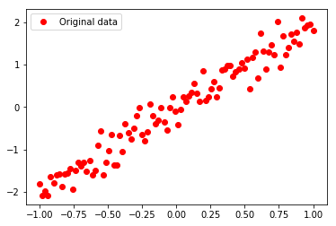

**【逻辑回归拟合二维数据】2018-12-18**

### 3.1 实列1：从一组看似混乱的数据中找出y≈2x的规律

##### 一 实例描述

> 假设有一组数据集，其中x和y的对应关系为出y≈2x。  
> 本实例就是让神经网络学习这些样本，并能够找到其中的规律，即让神经网络能够总结出y≈2x这样的公式。

##### 二 深度学习的4个步骤
1.  准备数据
2.  搭建模型
3.  迭代训练
4.  使用模型   

准备数据阶段一般就是把任务相关数据收集起来，然后建立网络模型，通过一定的迭代训练让网络学习到收集来的数据特征，形成可用的模型，之后就是使用模型来为我们解决问题。

##### 三 准备数据
这里使用y=2x这个公式来做主体，通过加入一些干扰噪声让它的“等号”变成“约等于”。  
代码算法:  
- 导入头文件，然后生成-1~1之间的100个数作为x
- 将x乘以2，再加上一个[-1,1]区间的随机数×0.3。即，y≈2×x+ax0.3（a属于[-1,1]之间的随机数）。

---

- 代码

```

import tensorflow as tf
import numpy as np
import matplotlib.pyplot as plt
 
#生成模拟数据
train_X = np.linspace(-1, 1, 100)
train_Y = 2 * train_X + np.random.randn(*train_X.shape) * 0.3 # y=2x，但是加入了噪声
#显示模拟数据点
plt.plot(train_X, train_Y, 'ro', label='Original data')
plt.legend()
plt.show()
```
### 实际问题
- **实践总是没有想象的一帆风顺**
---

- **Problem 01** 
- [ ] ImportError: Traceback (most recent call last):
```
ImportError: Traceback (most recent call last):
/XX/XX/XX/XXX/site-packages/h5py/__init__.py:36: FutureWarning: Conversion of the second argument of issubdtype from `float` to `np.floating` is deprecated. In future, it will be treated as `np.float64 == np.dtype(float).type`.
  from ._conv import register_converters as _register_converters
```
- **Solution 01** 
- [ ] 更新tensorflow 和 更新h5py （参考1 [a](https://blog.csdn.net/qq_41185868/article/details/79682551) 参考2 [b](https://blog.csdn.net/qq_41185868/article/details/80276847)）

```python
import tensorflow as tf
import numpy as np
import matplotlib.pyplot as plt
 
#生成模拟数据
train_X = np.linspace(-1, 1, 100)
train_Y = 2 * train_X + np.random.randn(*train_X.shape) * 0.3 # y=2x，但是加入了噪声
#显示模拟数据点
plt.plot(train_X, train_Y, 'ro', label='Original data')
plt.legend()
plt.show()
```



